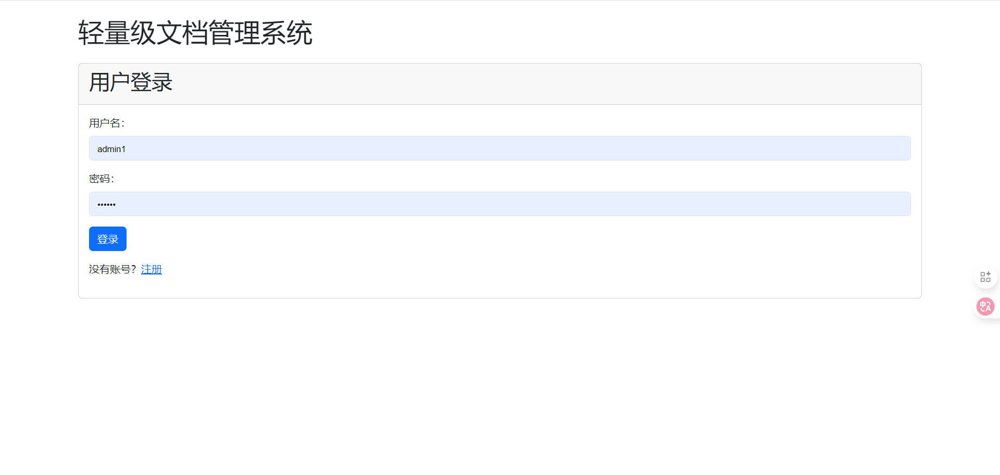
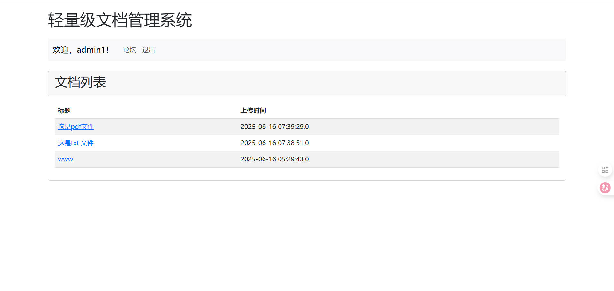
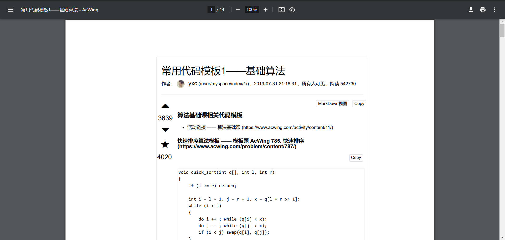
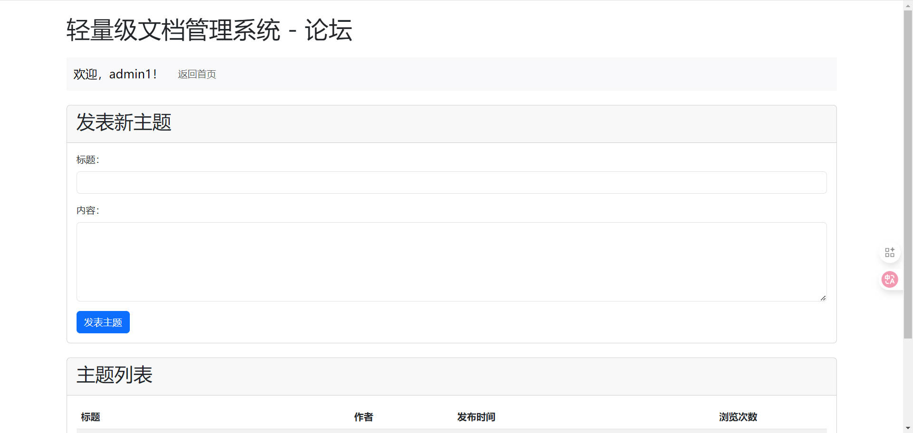
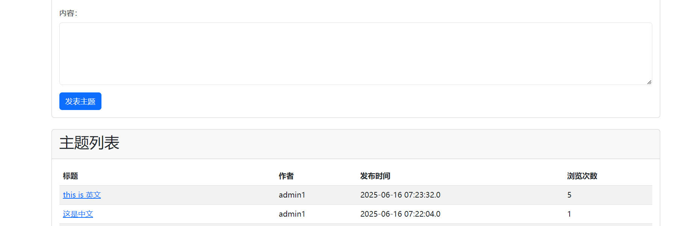

# 轻量级文档管理系统

## 目录
- [项目介绍](#项目介绍)
- [系统截图](#系统截图)
- [主要功能](#主要功能)
- [技术栈](#技术栈)
- [系统架构](#系统架构)
- [数据库设计](#数据库设计)
- [安装与部署](#安装与部署)
- [使用说明](#使用说明)
- [项目特点](#项目特点)
- [未来改进方向](#未来改进方向)
- [许可证](#许可证)
- [联系方式](#联系方式)

## 项目介绍

轻量级文档管理系统是一个基于Java Web技术开发的简易文档管理平台，主要用于文档的上传、下载和管理。系统还集成了用户管理和论坛功能，为用户提供了一个完整的文档共享与交流环境。

## 系统截图

### 登录界面

### 首页/文档管理

### 文档下载

### 论坛功能

### 论坛主题详情

## 主要功能

### 用户管理
- **用户注册**：新用户可以通过注册页面创建账号
- **用户登录**：已有账号的用户可以登录系统
- **权限控制**：区分普通用户和管理员权限

### 文档管理
- **文档上传**：管理员可以上传.txt/.pdf文档（限制2MB）
- **文档列表**：显示所有上传的文档，包括标题和上传时间
- **文档下载**：用户可以下载系统中的文档

### 论坛功能
- **发布主题**：登录用户可以发布新的讨论主题
- **回复功能**：用户可以回复已有主题
- **浏览统计**：记录主题的浏览次数

## 技术栈

- **前端**：HTML, Bootstrap 5
- **后端**：Java, JSP, Servlet
- **数据库**：MySQL
- **服务器**：Apache Tomcat 9.0
- **开发工具**：Eclipse

## 系统架构

系统采用经典的MVC架构：
- **Model**：Java Bean对象（Document, Topic, Reply等）
- **View**：JSP页面
- **Controller**：Servlet处理请求

## 数据库设计

系统包含以下数据表：
1. **users**：存储用户信息
   - id (主键)
   - username (用户名)
   - password (密码)

2. **documents**：存储文档信息
   - id (主键)
   - title (标题)
   - filename (文件名)
   - upload_time (上传时间)

3. **topics**：存储论坛主题
   - id (主键)
   - title (标题)
   - content (内容)
   - username (发布者)
   - create_time (创建时间)
   - view_count (浏览次数)

4. **replies**：存储论坛回复
   - id (主键)
   - topic_id (关联主题ID)
   - content (回复内容)
   - username (回复者)
   - create_time (回复时间)

## 安装与部署

### 环境要求
- JDK 8+
- Apache Tomcat 9.0+
- MySQL 5.7+
- Eclipse IDE

### 部署步骤
1. 克隆或下载项目到本地
2. 在Eclipse中导入项目
3. 配置Tomcat服务器
4. 创建MySQL数据库，执行`src/main/webapp/WEB-INF/db_init.sql`初始化数据库
5. 修改数据库连接参数（位于各Servlet和DAO类中）
6. 部署项目到Tomcat并启动

## 使用说明

### 管理员账号
- 用户名：admin
- 密码：123456

### 基本操作流程
1. 访问首页，使用管理员账号登录
2. 上传文档：在首页点击"上传"按钮
3. 下载文档：在文档列表中点击文档标题
4. 访问论坛：点击导航栏中的"论坛"链接
5. 发布主题：在论坛页面填写标题和内容
6. 回复主题：在主题详情页面底部填写回复内容

## 项目特点

- **轻量级**：系统设计简洁，易于部署和使用
- **功能完整**：包含文档管理和论坛交流两大核心功能
- **界面友好**：采用Bootstrap框架，界面美观且响应式
- **安全性**：实现了基本的用户认证和权限控制

## 未来改进方向

- 增强文件类型验证和安全性检查
- 实现更安全的密码存储机制（如加盐哈希）
- 添加文档搜索和分类功能
- 优化论坛功能，添加点赞、置顶等特性
- 实现更细粒度的权限控制系统

## 许可证

本项目采用MIT许可证。详情请参阅LICENSE文件。

## 联系方式

如有问题或建议，请联系项目维护者。

---

© 2025 轻量级文档管理系统 版权所有